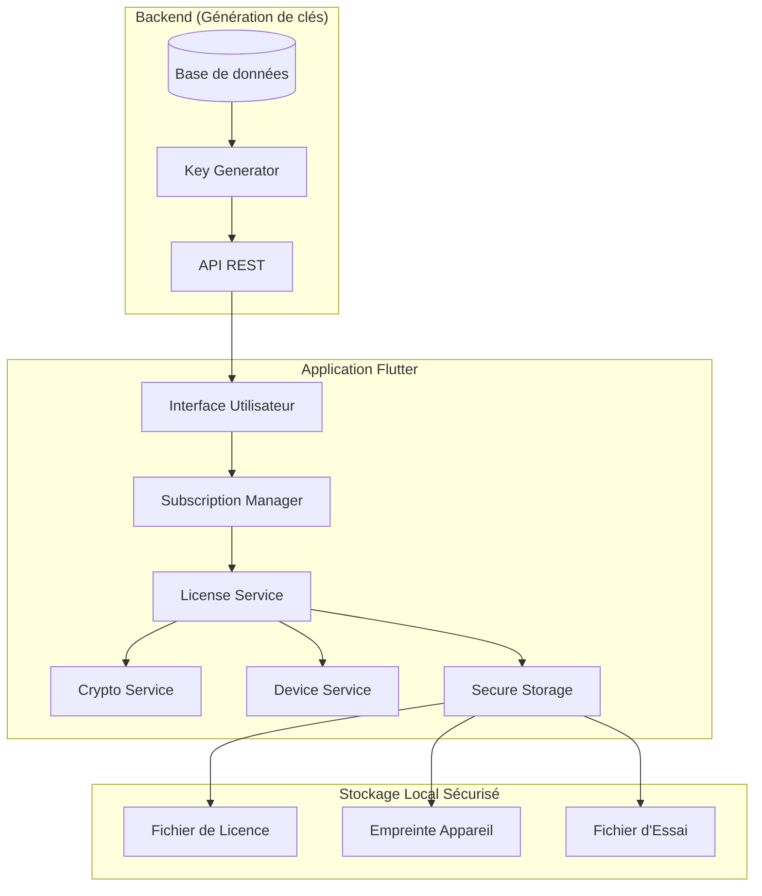

# Design Document - Système de Gestion des Abonnements

## Overview

Le système de gestion des abonnements est conçu comme un module autonome et sécurisé qui contrôle l'accès à l'application Logesco V2. Il utilise une architecture basée sur des clés d'activation cryptographiques pour fonctionner entièrement en mode offline, avec des mécanismes de sécurité multicouches pour prévenir le contournement.

## Architecture

### Architecture Globale



### Couches d'Architecture

1. **Couche Présentation** : Interface utilisateur Flutter
2. **Couche Business** : Logique de gestion des abonnements
3. **Couche Service** : Services cryptographiques et de validation
4. **Couche Persistance** : Stockage sécurisé local
5. **Couche Sécurité** : Chiffrement et obfuscation

## Components and Interfaces

### 1. Subscription Manager (Gestionnaire Principal)

```dart
abstract class ISubscriptionManager {
  Future<SubscriptionStatus> getCurrentStatus();
  Future<bool> activateLicense(String licenseKey);
  Future<void> startTrialPeriod();
  Future<bool> isTrialActive();
  Future<int> getRemainingTrialDays();
  Future<DateTime?> getExpirationDate();
  Stream<SubscriptionStatus> get statusStream;
}
```

**Responsabilités :**
- Orchestration de tous les services de licence
- Gestion des états d'abonnement
- Notifications aux utilisateurs
- Contrôles périodiques

### 2. License Service (Service de Validation)

```dart
abstract class ILicenseService {
  Future<LicenseValidationResult> validateLicense(String licenseKey);
  Future<bool> isLicenseValid();
  Future<void> storeLicense(LicenseData license);
  Future<LicenseData?> getStoredLicense();
  Future<void> revokeLicense();
}
```

**Responsabilités :**
- Validation cryptographique des clés
- Stockage sécurisé des licences
- Vérification de l'intégrité

### 3. Crypto Service (Service Cryptographique)

```dart
abstract class ICryptoService {
  bool verifySignature(String data, String signature, String publicKey);
  String generateHash(String input);
  String encryptData(String data, String key);
  String decryptData(String encryptedData, String key);
  bool verifyIntegrity(String data, String checksum);
}
```

**Responsabilités :**
- Vérification des signatures RSA
- Chiffrement/déchiffrement des données
- Génération de hachages sécurisés

### 4. Device Service (Service d'Empreinte)

```dart
abstract class IDeviceService {
  Future<String> generateDeviceFingerprint();
  Future<bool> verifyDeviceFingerprint(String storedFingerprint);
  Future<Map<String, String>> getDeviceInfo();
}
```

**Responsabilités :**
- Génération d'empreinte unique de l'appareil
- Vérification de l'identité de l'appareil
- Collecte d'informations matérielles

## Data Models

### 1. License Data Model

```dart
class LicenseData {
  final String userId;
  final String licenseKey;
  final SubscriptionType subscriptionType;
  final DateTime issuedAt;
  final DateTime expiresAt;
  final String deviceFingerprint;
  final String signature;
  final Map<String, dynamic> metadata;
}

enum SubscriptionType {
  trial,
  monthly,
  annual,
  lifetime
}
```

### 2. Subscription Status Model

```dart
class SubscriptionStatus {
  final bool isActive;
  final SubscriptionType type;
  final DateTime? expirationDate;
  final int? remainingDays;
  final bool isInGracePeriod;
  final List<String> warnings;
}
```

### 3. Device Fingerprint Model

```dart
class DeviceFingerprint {
  final String deviceId;
  final String platform;
  final String osVersion;
  final String appVersion;
  final String hardwareId;
  final String combinedHash;
  final DateTime generatedAt;
}
```

### 4. License Key Structure

```
Format de la clé : BASE64(JSON_ENCRYPTED)

Structure JSON avant chiffrement :
{
  "userId": "user_unique_id",
  "type": "monthly|annual|lifetime",
  "issued": "2024-01-01T00:00:00Z",
  "expires": "2024-02-01T00:00:00Z",
  "device": "device_fingerprint_hash",
  "features": ["feature1", "feature2"],
  "signature": "rsa_signature"
}
```

## Error Handling

### 1. Stratégie de Gestion d'Erreurs

```dart
enum LicenseError {
  invalidKey,
  expiredLicense,
  deviceMismatch,
  tamperingDetected,
  cryptographicFailure,
  storageError,
  networkError
}

class LicenseException implements Exception {
  final LicenseError error;
  final String message;
  final String? details;
  
  const LicenseException(this.error, this.message, [this.details]);
}
```

### 2. Modes de Dégradation

1. **Mode Normal** : Toutes les fonctionnalités disponibles
2. **Mode Avertissement** : Notifications d'expiration (3 jours avant)
3. **Mode Grâce** : Fonctionnalités limitées (3 jours après expiration)
4. **Mode Bloqué** : Accès lecture seule uniquement
5. **Mode Sécurisé** : Blocage complet en cas de tentative de contournement

### 3. Récupération d'Erreurs

```dart
class ErrorRecoveryStrategy {
  static Future<void> handleLicenseError(LicenseError error) async {
    switch (error) {
      case LicenseError.expiredLicense:
        await _enterGracePeriod();
        break;
      case LicenseError.deviceMismatch:
        await _requestLicenseTransfer();
        break;
      case LicenseError.tamperingDetected:
        await _lockApplication();
        break;
      default:
        await _showErrorDialog();
    }
  }
}
```

## Testing Strategy

### 1. Tests Unitaires

- **Crypto Service** : Validation des signatures, chiffrement/déchiffrement
- **Device Service** : Génération d'empreintes, détection de changements
- **License Service** : Validation de clés, gestion d'expiration
- **Subscription Manager** : Logique métier, transitions d'états

### 2. Tests d'Intégration

- **Flux complet d'activation** : De la saisie de clé à l'activation
- **Scénarios d'expiration** : Comportement lors de l'expiration
- **Tests de sécurité** : Tentatives de contournement
- **Tests de persistance** : Stockage et récupération des données

### 3. Tests de Sécurité

- **Fuzzing des clés** : Test avec des clés malformées
- **Tests de manipulation** : Modification des fichiers de licence
- **Tests de rejeu** : Réutilisation de clés sur différents appareils
- **Tests de performance** : Impact sur le démarrage de l'application

### 4. Tests de Scénarios Métier

```dart
// Exemple de test de scénario
testWidgets('Trial period expiration flow', (WidgetTester tester) async {
  // 1. Démarrer période d'essai
  await subscriptionManager.startTrialPeriod();
  
  // 2. Simuler expiration
  await tester.binding.clock.elapse(Duration(days: 8));
  
  // 3. Vérifier blocage
  final status = await subscriptionManager.getCurrentStatus();
  expect(status.isActive, false);
  
  // 4. Vérifier UI de blocage
  await tester.pumpAndSettle();
  expect(find.text('Période d\'essai expirée'), findsOneWidget);
});
```

## Sécurité et Obfuscation

### 1. Mesures de Sécurité

- **Clés publiques intégrées** : Stockage sécurisé dans l'application
- **Validation multi-niveaux** : Signature + empreinte + intégrité
- **Anti-debugging** : Détection des outils de débogage
- **Code obfusqué** : Utilisation d'outils d'obfuscation Flutter

### 2. Protection contre le Reverse Engineering

```dart
// Exemple de protection (à obfusquer)
class SecurityValidator {
  static bool _validateEnvironment() {
    // Vérifications anti-debug
    if (_isDebuggerAttached()) return false;
    if (_isEmulator()) return false;
    if (_isRooted()) return false;
    return true;
  }
  
  static bool _verifyCodeIntegrity() {
    // Vérification de l'intégrité du code
    final expectedHash = "sha256_hash_of_critical_code";
    final actualHash = _calculateCodeHash();
    return expectedHash == actualHash;
  }
}
```

### 3. Stockage Sécurisé

- **flutter_secure_storage** : Chiffrement au niveau OS
- **Fragmentation des données** : Division des informations sensibles
- **Checksums** : Vérification d'intégrité des fichiers
- **Rotation des clés** : Renouvellement périodique des clés de chiffrement

## Performance et Optimisation

### 1. Optimisations de Performance

- **Cache en mémoire** : Mise en cache des validations récentes
- **Validation asynchrone** : Contrôles en arrière-plan
- **Lazy loading** : Chargement à la demande des services
- **Batch operations** : Regroupement des opérations cryptographiques

### 2. Monitoring et Métriques

```dart
class LicenseMetrics {
  static void trackValidation(bool success, Duration duration) {
    // Tracking des performances de validation
  }
  
  static void trackActivation(SubscriptionType type) {
    // Tracking des activations par type
  }
  
  static void trackError(LicenseError error) {
    // Tracking des erreurs pour amélioration
  }
}
```

Cette architecture garantit un système robuste, sécurisé et performant pour la gestion des abonnements en mode offline, avec des mécanismes de protection multicouches contre le contournement.